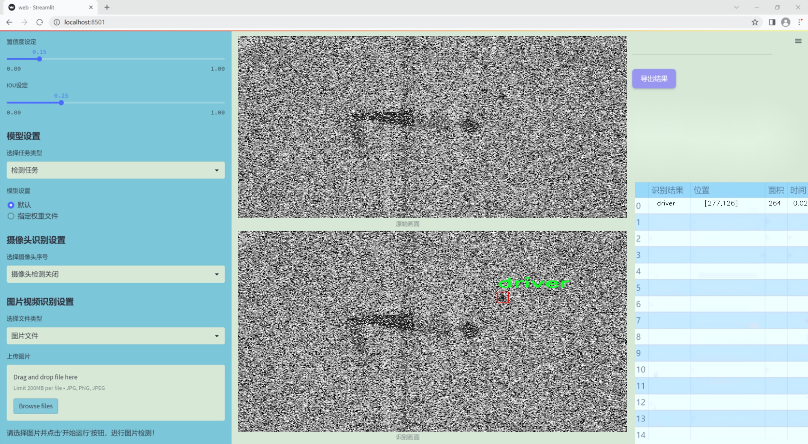
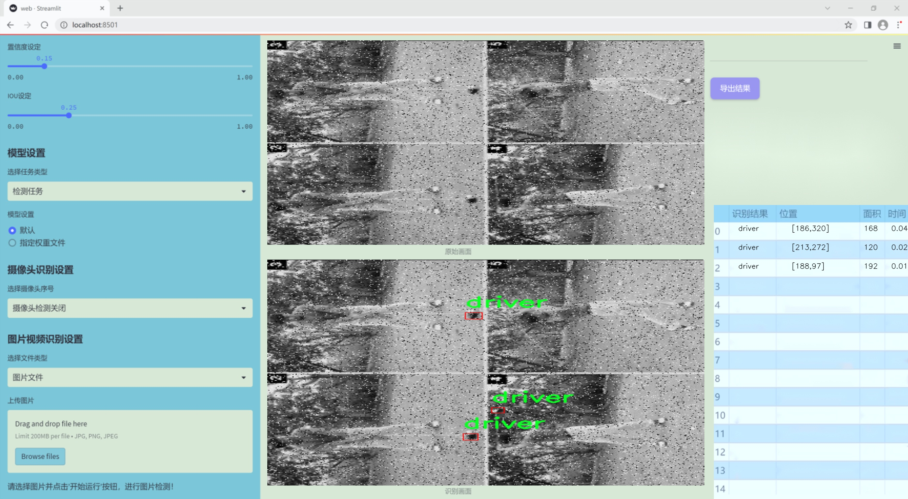
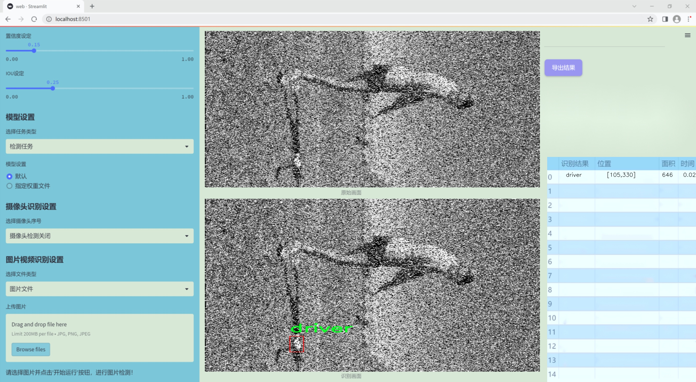
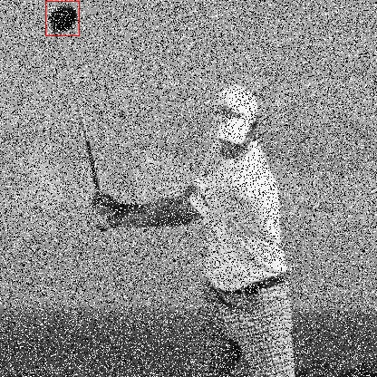
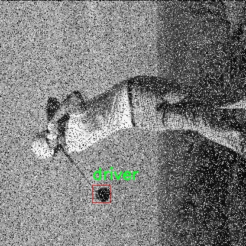
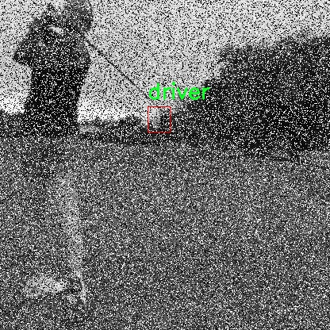
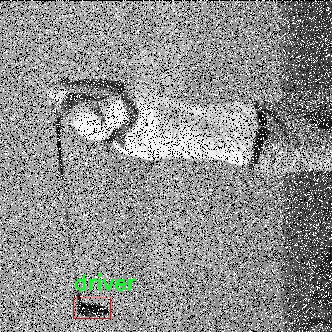
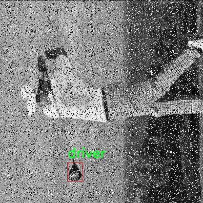

# 改进yolo11-dysample等200+全套创新点大全：高尔夫球杆检测系统源码＆数据集全套

### 1.图片效果展示







##### 项目来源 **[人工智能促进会 2024.10.30](https://kdocs.cn/l/cszuIiCKVNis)**

注意：由于项目一直在更新迭代，上面“1.图片效果展示”和“2.视频效果展示”展示的系统图片或者视频可能为老版本，新版本在老版本的基础上升级如下：（实际效果以升级的新版本为准）

  （1）适配了YOLOV11的“目标检测”模型和“实例分割”模型，通过加载相应的权重（.pt）文件即可自适应加载模型。

  （2）支持“图片识别”、“视频识别”、“摄像头实时识别”三种识别模式。

  （3）支持“图片识别”、“视频识别”、“摄像头实时识别”三种识别结果保存导出，解决手动导出（容易卡顿出现爆内存）存在的问题，识别完自动保存结果并导出到tempDir中。

  （4）支持Web前端系统中的标题、背景图等自定义修改。

  另外本项目提供训练的数据集和训练教程,暂不提供权重文件（best.pt）,需要您按照教程进行训练后实现图片演示和Web前端界面演示的效果。

### 2.视频效果展示

[2.1 视频效果展示](https://www.bilibili.com/video/BV1NLSiYVERQ/)

### 3.背景

研究背景与意义

随着计算机视觉技术的快速发展，物体检测在各个领域的应用愈发广泛，尤其是在体育运动领域。高尔夫作为一项受欢迎的运动，其相关装备的检测与分析逐渐成为研究的热点。高尔夫球杆作为高尔夫运动中最重要的装备之一，其种类繁多、设计各异，准确识别和分类不同类型的高尔夫球杆对于提升运动员的训练效果和比赛表现具有重要意义。因此，开发一个高效、准确的高尔夫球杆检测系统显得尤为重要。

本研究旨在基于改进的YOLOv11模型，构建一个高尔夫球杆检测系统。YOLO（You Only Look Once）系列模型以其快速的检测速度和较高的准确率而受到广泛关注。通过对YOLOv11的改进，我们期望在保持实时检测能力的同时，进一步提升其在高尔夫球杆检测中的性能。数据集方面，我们使用了包含712张高尔夫球杆图像的“golf-driver”模块，尽管图像数量相对较少，但通过数据增强和迁移学习等技术，可以有效提升模型的泛化能力和检测精度。

此外，针对高尔夫球杆的多样性和复杂性，本研究将深入探讨不同类型球杆的特征提取和分类方法，以实现对球杆的精准识别。这不仅有助于运动员选择合适的球杆，还能为教练提供科学的训练指导依据。综上所述，本研究不仅具有重要的理论价值，还有助于推动高尔夫运动的智能化发展，为相关领域的研究提供新的思路和方法。

### 4.数据集信息展示

##### 4.1 本项目数据集详细数据（类别数＆类别名）

nc: 1
names: ['driver']


该项目为【目标检测】数据集，请在【训练教程和Web端加载模型教程（第三步）】这一步的时候按照【目标检测】部分的教程来训练

##### 4.2 本项目数据集信息介绍

本项目数据集信息介绍

本项目所使用的数据集名为“golf-driver”，旨在为改进YOLOv11的高尔夫球杆检测系统提供高质量的训练数据。该数据集专注于高尔夫球杆中的“driver”类别，类别数量为1，体现了我们对特定目标的深入研究和精确识别的需求。通过专注于这一单一类别，我们能够在数据收集和标注过程中，确保每个样本的高质量和一致性，从而为模型的训练提供更加精准的基础。

“golf-driver”数据集包含了多种不同环境和角度下的高尔夫球杆图像，这些图像来源于多种场景，包括高尔夫球场、练习场以及室内模拟器等。这种多样性使得模型在面对不同背景和光照条件时，能够更好地适应和识别目标物体。此外，数据集中还包含了不同品牌和型号的高尔夫球杆，以增加样本的多样性和复杂性，从而提升模型的泛化能力。

在数据标注方面，所有图像均经过严格的标注流程，确保“driver”类别的准确性和一致性。标注过程中，采用了先进的图像处理技术和人工审核相结合的方法，以消除潜在的标注错误。这一过程不仅提高了数据集的可靠性，也为后续的模型训练奠定了坚实的基础。

通过使用“golf-driver”数据集，我们期望能够显著提升YOLOv11在高尔夫球杆检测任务中的性能，使其在实际应用中具备更高的准确性和效率。这一数据集的构建和应用，标志着我们在高尔夫运动相关技术研究领域迈出了重要的一步，为未来的研究和应用提供了宝贵的资源。











### 5.全套项目环境部署视频教程（零基础手把手教学）

[5.1 所需软件PyCharm和Anaconda安装教程（第一步）](https://www.bilibili.com/video/BV1BoC1YCEKi/?spm_id_from=333.999.0.0&vd_source=bc9aec86d164b67a7004b996143742dc)


[5.2 安装Python虚拟环境创建和依赖库安装视频教程（第二步）](https://www.bilibili.com/video/BV1ZoC1YCEBw?spm_id_from=333.788.videopod.sections&vd_source=bc9aec86d164b67a7004b996143742dc)

### 6.改进YOLOv11训练教程和Web_UI前端加载模型教程（零基础手把手教学）

[6.1 改进YOLOv11训练教程和Web_UI前端加载模型教程（第三步）](https://www.bilibili.com/video/BV1BoC1YCEhR?spm_id_from=333.788.videopod.sections&vd_source=bc9aec86d164b67a7004b996143742dc)


按照上面的训练视频教程链接加载项目提供的数据集，运行train.py即可开始训练



     Epoch   gpu_mem       box       obj       cls    labels  img_size
     1/200     20.8G   0.01576   0.01955  0.007536        22      1280: 100%|██████████| 849/849 [14:42<00:00,  1.04s/it]
               Class     Images     Labels          P          R     mAP@.5 mAP@.5:.95: 100%|██████████| 213/213 [01:14<00:00,  2.87it/s]
                 all       3395      17314      0.994      0.957      0.0957      0.0843

     Epoch   gpu_mem       box       obj       cls    labels  img_size
     2/200     20.8G   0.01578   0.01923  0.007006        22      1280: 100%|██████████| 849/849 [14:44<00:00,  1.04s/it]
               Class     Images     Labels          P          R     mAP@.5 mAP@.5:.95: 100%|██████████| 213/213 [01:12<00:00,  2.95it/s]
                 all       3395      17314      0.996      0.956      0.0957      0.0845

     Epoch   gpu_mem       box       obj       cls    labels  img_size
     3/200     20.8G   0.01561    0.0191  0.006895        27      1280: 100%|██████████| 849/849 [10:56<00:00,  1.29it/s]
               Class     Images     Labels          P          R     mAP@.5 mAP@.5:.95: 100%|███████   | 187/213 [00:52<00:00,  4.04it/s]
                 all       3395      17314      0.996      0.957      0.0957      0.0845


###### [项目数据集下载链接](https://kdocs.cn/l/cszuIiCKVNis)

### 7.原始YOLOv11算法讲解

##### YOLO11简介

> YOLO11源码地址：https://github.com/ultralytics/ultralytics

Ultralytics
YOLO11是一款尖端的、最先进的模型，它在之前YOLO版本成功的基础上进行了构建，并引入了新功能和改进，以进一步提升性能和灵活性。YOLO11设计快速、准确且易于使用，使其成为各种物体检测和跟踪、实例分割、图像分类以及姿态估计任务的绝佳选择。  


**YOLO11创新点如下:**

YOLO 11主要改进包括：  
`增强的特征提取`：YOLO 11采用了改进的骨干和颈部架构，增强了特征提取功能，以实现更精确的目标检测。  
`优化的效率和速度`：优化的架构设计和优化的训练管道提供更快的处理速度，同时保持准确性和性能之间的平衡。  
`更高的精度，更少的参数`：YOLO11m在COCO数据集上实现了更高的平均精度（mAP），参数比YOLOv8m少22%，使其在不影响精度的情况下提高了计算效率。  
`跨环境的适应性`：YOLO 11可以部署在各种环境中，包括边缘设备、云平台和支持NVIDIA GPU的系统。  
`广泛的支持任务`：YOLO 11支持各种计算机视觉任务，如对象检测、实例分割、图像分类、姿态估计和面向对象检测（OBB）。

**YOLO11不同模型尺寸信息：**

YOLO11 提供5种不同的型号规模模型，以满足不同的应用需求：

Model| size (pixels)| mAPval 50-95| Speed CPU ONNX (ms)| Speed T4 TensorRT10
(ms)| params (M)| FLOPs (B)  
---|---|---|---|---|---|---  
YOLO11n| 640| 39.5| 56.1 ± 0.8| 1.5 ± 0.0| 2.6| 6.5  
YOLO11s| 640| 47.0| 90.0 ± 1.2| 2.5 ± 0.0| 9.4| 21.5  
YOLO11m| 640| 51.5| 183.2 ± 2.0| 4.7 ± 0.1| 20.1| 68.0  
YOLO11l| 640| 53.4| 238.6 ± 1.4| 6.2 ± 0.1| 25.3| 86.9  
YOLO11x| 640| 54.7| 462.8 ± 6.7| 11.3 ± 0.2| 56.9| 194.9  
  
**模型常用训练超参数参数说明：**  
`YOLOv11
模型的训练设置包括训练过程中使用的各种超参数和配置`。这些设置会影响模型的性能、速度和准确性。关键的训练设置包括批量大小、学习率、动量和权重衰减。此外，优化器、损失函数和训练数据集组成的选择也会影响训练过程。对这些设置进行仔细的调整和实验对于优化性能至关重要。  
**以下是一些常用的模型训练参数和说明：**

参数名| 默认值| 说明  
---|---|---  
`model`| `None`| 指定用于训练的模型文件。接受指向 `.pt` 预训练模型或 `.yaml`
配置文件。对于定义模型结构或初始化权重至关重要。  
`data`| `None`| 数据集配置文件的路径（例如
`coco8.yaml`).该文件包含特定于数据集的参数，包括训练数据和验证数据的路径、类名和类数。  
`epochs`| `100`| 训练总轮数。每个epoch代表对整个数据集进行一次完整的训练。调整该值会影响训练时间和模型性能。  
`patience`| `100`| 在验证指标没有改善的情况下，提前停止训练所需的epoch数。当性能趋于平稳时停止训练，有助于防止过度拟合。  
`batch`| `16`| 批量大小，有三种模式:设置为整数(例如，’ Batch =16 ‘)， 60% GPU内存利用率的自动模式(’ Batch
=-1 ‘)，或指定利用率分数的自动模式(’ Batch =0.70 ')。  
`imgsz`| `640`| 用于训练的目标图像尺寸。所有图像在输入模型前都会被调整到这一尺寸。影响模型精度和计算复杂度。  
`device`| `None`| 指定用于训练的计算设备：单个 GPU (`device=0`）、多个 GPU (`device=0,1`)、CPU
(`device=cpu`)，或苹果芯片的 MPS (`device=mps`).  
`workers`| `8`| 加载数据的工作线程数（每 `RANK` 多 GPU 训练）。影响数据预处理和输入模型的速度，尤其适用于多 GPU 设置。  
`name`| `None`| 训练运行的名称。用于在项目文件夹内创建一个子目录，用于存储训练日志和输出结果。  
`pretrained`| `True`| 决定是否从预处理模型开始训练。可以是布尔值，也可以是加载权重的特定模型的字符串路径。提高训练效率和模型性能。  
`optimizer`| `'auto'`| 为训练模型选择优化器。选项包括 `SGD`, `Adam`, `AdamW`, `NAdam`,
`RAdam`, `RMSProp` 等，或 `auto` 用于根据模型配置进行自动选择。影响收敛速度和稳定性  
`lr0`| `0.01`| 初始学习率（即 `SGD=1E-2`, `Adam=1E-3`) .调整这个值对优化过程至关重要，会影响模型权重的更新速度。  
`lrf`| `0.01`| 最终学习率占初始学习率的百分比 = (`lr0 * lrf`)，与调度程序结合使用，随着时间的推移调整学习率。  


**各损失函数作用说明：**  
`定位损失box_loss`：预测框与标定框之间的误差（GIoU），越小定位得越准；  
`分类损失cls_loss`：计算锚框与对应的标定分类是否正确，越小分类得越准；  
`动态特征损失（dfl_loss）`：DFLLoss是一种用于回归预测框与目标框之间距离的损失函数。在计算损失时，目标框需要缩放到特征图尺度，即除以相应的stride，并与预测的边界框计算Ciou
Loss，同时与预测的anchors中心点到各边的距离计算回归DFLLoss。  


### 8.200+种全套改进YOLOV11创新点原理讲解

#### 8.1 200+种全套改进YOLOV11创新点原理讲解大全

由于篇幅限制，每个创新点的具体原理讲解就不全部展开，具体见下列网址中的改进模块对应项目的技术原理博客网址【Blog】（创新点均为模块化搭建，原理适配YOLOv5~YOLOv11等各种版本）

[改进模块技术原理博客【Blog】网址链接](https://gitee.com/qunmasj/good)


#### 8.2 精选部分改进YOLOV11创新点原理讲解

###### 这里节选部分改进创新点展开原理讲解(完整的改进原理见上图和[改进模块技术原理博客链接](https://gitee.com/qunmasj/good)【如果此小节的图加载失败可以通过CSDN或者Github搜索该博客的标题访问原始博客，原始博客图片显示正常】
### RepViT简介

近年来，与轻量级卷积神经网络(cnn)相比，轻量级视觉变压器(ViTs)在资源受限的移动设备上表现出了更高的性能和更低的延迟。这种改进通常归功于多头自注意模块，它使模型能够学习全局表示。然而，轻量级vit和轻量级cnn之间的架构差异还没有得到充分的研究。在这项研究中，我们重新审视了轻量级cnn的高效设计，并强调了它们在移动设备上的潜力。通过集成轻量级vit的高效架构选择，我们逐步增强了标准轻量级CNN的移动友好性，特别是MobileNetV3。这就产生了一个新的纯轻量级cnn家族，即RepViT。大量的实验表明，RepViT优于现有的轻型vit，并在各种视觉任务中表现出良好的延迟。在ImageNet上，RepViT在iPhone 12上以近1ms的延迟实现了超过80%的top-1精度，据我们所知，这是轻量级模型的第一次。

#### RepViT简介
轻量级模型研究一直是计算机视觉任务中的一个焦点，其目标是在降低计算成本的同时达到优秀的性能。轻量级模型与资源受限的移动设备尤其相关，使得视觉模型的边缘部署成为可能。在过去十年中，研究人员主要关注轻量级卷积神经网络（CNNs）的设计，提出了许多高效的设计原则，包括可分离卷积 、逆瓶颈结构 、通道打乱 和结构重参数化等，产生了 MobileNets ，ShuffleNets和 RepVGG 等代表性模型。

另一方面，视觉 Transformers（ViTs）成为学习视觉表征的另一种高效方案。与 CNNs 相比，ViTs 在各种计算机视觉任务中表现出了更优越的性能。然而，ViT 模型一般尺寸很大，延迟很高，不适合资源受限的移动设备。因此，研究人员开始探索 ViT 的轻量级设计。许多高效的ViTs设计原则被提出，大大提高了移动设备上 ViTs 的计算效率，产生了EfficientFormers ，MobileViTs等代表性模型。这些轻量级 ViTs 在移动设备上展现出了相比 CNNs 的更强的性能和更低的延迟。

轻量级 ViTs 优于轻量级 CNNs 的原因通常归结于多头注意力模块，该模块使模型能够学习全局表征。然而，轻量级 ViTs 和轻量级 CNNs 在块结构、宏观和微观架构设计方面存在值得注意的差异，但这些差异尚未得到充分研究。这自然引出了一个问题：轻量级 ViTs 的架构选择能否提高轻量级 CNN 的性能？在这项工作中，我们结合轻量级 ViTs 的架构选择，重新审视了轻量级 CNNs 的设计。我们的旨在缩小轻量级 CNNs 与轻量级 ViTs 之间的差距，并强调前者与后者相比在移动设备上的应用潜力。


在 ConvNeXt 中，参考该博客提出的基于 ResNet50 架构的基础上通过严谨的理论和实验分析，最终设计出一个非常优异的足以媲美 Swin-Transformer 的纯卷积神经网络架构。同样地，RepViT也是主要通过将轻量级 ViTs 的架构设计逐步整合到标准轻量级 CNN，即MobileNetV3-L，来对其进行针对性地改造（魔改）。在这个过程中，作者们考虑了不同粒度级别的设计元素，并通过一系列步骤达到优化的目标。


详细优化步骤如下：

#### 训练配方的对齐
论文中引入了一种衡量移动设备上延迟的指标，并将训练策略与现有的轻量级 ViTs 对齐。这一步骤主要是为了确保模型训练的一致性，其涉及两个概念，即延迟度量和训练策略的调整。

#### 延迟度量指标
为了更准确地衡量模型在真实移动设备上的性能，作者选择了直接测量模型在设备上的实际延迟，以此作为基准度量。这个度量方法不同于之前的研究，它们主要通过FLOPs或模型大小等指标优化模型的推理速度，这些指标并不总能很好地反映在移动应用中的实际延迟。

#### 训练策略的对齐
这里，将 MobileNetV3-L 的训练策略调整以与其他轻量级 ViTs 模型对齐。这包括使用 AdamW 优化器-ViTs 模型必备的优化器，进行 5 个 epoch 的预热训练，以及使用余弦退火学习率调度进行 300 个 epoch 的训练。尽管这种调整导致了模型准确率的略微下降，但可以保证公平性。

#### 块设计的优化
基于一致的训练设置，作者们探索了最优的块设计。块设计是 CNN 架构中的一个重要组成部分，优化块设计有助于提高网络的性能。

#### 分离 Token 混合器和通道混合器
这块主要是对 MobileNetV3-L 的块结构进行了改进，分离了令牌混合器和通道混合器。原来的 MobileNetV3 块结构包含一个 1x1 扩张卷积，然后是一个深度卷积和一个 1x1 的投影层，然后通过残差连接连接输入和输出。在此基础上，RepViT 将深度卷积提前，使得通道混合器和令牌混合器能够被分开。为了提高性能，还引入了结构重参数化来在训练时为深度滤波器引入多分支拓扑。最终，作者们成功地在 MobileNetV3 块中分离了令牌混合器和通道混合器，并将这种块命名为 RepViT 块。

#### 降低扩张比例并增加宽度
在通道混合器中，原本的扩张比例是 4，这意味着 MLP 块的隐藏维度是输入维度的四倍，消耗了大量的计算资源，对推理时间有很大的影响。为了缓解这个问题，我们可以将扩张比例降低到 2，从而减少了参数冗余和延迟，使得 MobileNetV3-L 的延迟降低到 0.65ms。随后，通过增加网络的宽度，即增加各阶段的通道数量，Top-1 准确率提高到 73.5%，而延迟只增加到 0.89ms！

#### 宏观架构元素的优化
在这一步，本文进一步优化了MobileNetV3-L在移动设备上的性能，主要是从宏观架构元素出发，包括 stem，降采样层，分类器以及整体阶段比例。通过优化这些宏观架构元素，模型的性能可以得到显著提高。

#### 浅层网络使用卷积提取器
ViTs 通常使用一个将输入图像分割成非重叠补丁的 “patchify” 操作作为 stem。然而，这种方法在训练优化性和对训练配方的敏感性上存在问题。因此，作者们采用了早期卷积来代替，这种方法已经被许多轻量级 ViTs 所采纳。对比之下，MobileNetV3-L 使用了一个更复杂的 stem 进行 4x 下采样。这样一来，虽然滤波器的初始数量增加到24，但总的延迟降低到0.86ms，同时 top-1 准确率提高到 73.9%。

#### 更深的下采样层
在 ViTs 中，空间下采样通常通过一个单独的补丁合并层来实现。因此这里我们可以采用一个单独和更深的下采样层，以增加网络深度并减少由于分辨率降低带来的信息损失。具体地，作者们首先使用一个 1x1 卷积来调整通道维度，然后将两个 1x1 卷积的输入和输出通过残差连接，形成一个前馈网络。此外，他们还在前面增加了一个 RepViT 块以进一步加深下采样层，这一步提高了 top-1 准确率到 75.4%，同时延迟为 0.96ms。

#### 更简单的分类器
在轻量级 ViTs 中，分类器通常由一个全局平均池化层后跟一个线性层组成。相比之下，MobileNetV3-L 使用了一个更复杂的分类器。因为现在最后的阶段有更多的通道，所以作者们将它替换为一个简单的分类器，即一个全局平均池化层和一个线性层，这一步将延迟降低到 0.77ms，同时 top-1 准确率为 74.8%。

#### 整体阶段比例
阶段比例代表了不同阶段中块数量的比例，从而表示了计算在各阶段中的分布。论文选择了一个更优的阶段比例 1:1:7:1，然后增加网络深度到 2:2:14:2，从而实现了一个更深的布局。这一步将 top-1 准确率提高到 76.9%，同时延迟为 1.02 ms。

#### 卷积核大小的选择
众所周知，CNNs 的性能和延迟通常受到卷积核大小的影响。例如，为了建模像 MHSA 这样的远距离上下文依赖，ConvNeXt 使用了大卷积核，从而实现了显著的性能提升。然而，大卷积核对于移动设备并不友好，因为它的计算复杂性和内存访问成本。MobileNetV3-L 主要使用 3x3 的卷积，有一部分块中使用 5x5 的卷积。作者们将它们替换为3x3的卷积，这导致延迟降低到 1.00ms，同时保持了76.9%的top-1准确率。

#### SE 层的位置
自注意力模块相对于卷积的一个优点是根据输入调整权重的能力，这被称为数据驱动属性。作为一个通道注意力模块，SE层可以弥补卷积在缺乏数据驱动属性上的限制，从而带来更好的性能。MobileNetV3-L 在某些块中加入了SE层，主要集中在后两个阶段。然而，与分辨率较高的阶段相比，分辨率较低的阶段从SE提供的全局平均池化操作中获得的准确率提升较小。作者们设计了一种策略，在所有阶段以交叉块的方式使用SE层，从而在最小的延迟增量下最大化准确率的提升，这一步将top-1准确率提升到77.4%，同时延迟降低到0.87ms。

注意！【这一点其实百度在很早前就已经做过实验比对得到过这个结论了，SE 层放置在靠近深层的地方效果好】

#### 微观设计的调整
RepViT 通过逐层微观设计来调整轻量级 CNN，这包括选择合适的卷积核大小和优化挤压-激励（Squeeze-and-excitation，简称SE）层的位置。这两种方法都能显著改善模型性能。

#### 网络架构
最终，通过整合上述改进策略，我们便得到了模型RepViT的整体架构，该模型有多个变种，例如RepViT-M1/M2/M3。同样地，不同的变种主要通过每个阶段的通道数和块数来区分。


### 9.系统功能展示

图9.1.系统支持检测结果表格显示

  图9.2.系统支持置信度和IOU阈值手动调节

  图9.3.系统支持自定义加载权重文件best.pt(需要你通过步骤5中训练获得)

  图9.4.系统支持摄像头实时识别

  图9.5.系统支持图片识别

  图9.6.系统支持视频识别

  图9.7.系统支持识别结果文件自动保存

  图9.8.系统支持Excel导出检测结果数据


### 10. YOLOv11核心改进源码讲解

#### 10.1 pkinet.py

以下是经过简化和注释的核心代码部分，保留了主要功能并添加了详细的中文注释：

```python
import math
import torch
import torch.nn as nn

# 定义随机丢弃路径的函数
def drop_path(x: torch.Tensor, drop_prob: float = 0., training: bool = False) -> torch.Tensor:
    """在残差块的主路径上随机丢弃路径（随机深度）。
    
    参数:
        x (torch.Tensor): 输入张量。
        drop_prob (float): 丢弃路径的概率。默认值为0。
        training (bool): 是否在训练模式下。默认值为False。
    
    返回:
        torch.Tensor: 处理后的张量。
    """
    if drop_prob == 0. or not training:
        return x  # 如果丢弃概率为0或不在训练中，返回原始输入
    keep_prob = 1 - drop_prob
    shape = (x.shape[0], ) + (1, ) * (x.ndim - 1)  # 处理不同维度的张量
    random_tensor = keep_prob + torch.rand(shape, dtype=x.dtype, device=x.device)
    output = x.div(keep_prob) * random_tensor.floor()  # 应用丢弃
    return output

# 定义DropPath类
class DropPath(nn.Module):
    """随机丢弃路径的模块"""
    def __init__(self, drop_prob: float = 0.1):
        super().__init__()
        self.drop_prob = drop_prob  # 丢弃概率

    def forward(self, x: torch.Tensor) -> torch.Tensor:
        return drop_path(x, self.drop_prob, self.training)  # 调用drop_path函数

# 定义全局Sigmoid门控线性单元
class GSiLU(nn.Module):
    """全局Sigmoid门控线性单元"""
    def __init__(self):
        super().__init__()
        self.adpool = nn.AdaptiveAvgPool2d(1)  # 自适应平均池化

    def forward(self, x):
        return x * torch.sigmoid(self.adpool(x))  # 应用Sigmoid激活

# 定义多层感知机模块
class ConvFFN(nn.Module):
    """使用ConvModule实现的多层感知机"""
    def __init__(self, in_channels: int, out_channels: Optional[int] = None, hidden_channels_scale: float = 4.0):
        super().__init__()
        out_channels = out_channels or in_channels  # 如果未指定输出通道，则使用输入通道
        hidden_channels = int(in_channels * hidden_channels_scale)  # 计算隐藏通道数

        self.ffn_layers = nn.Sequential(
            nn.LayerNorm(in_channels),  # 层归一化
            nn.Conv2d(in_channels, hidden_channels, kernel_size=1),  # 1x1卷积
            nn.Conv2d(hidden_channels, hidden_channels, kernel_size=3, padding=1, groups=hidden_channels),  # 深度卷积
            GSiLU(),  # 应用GSiLU激活
            nn.Conv2d(hidden_channels, out_channels, kernel_size=1)  # 1x1卷积
        )

    def forward(self, x):
        return self.ffn_layers(x)  # 前向传播

# 定义主网络结构
class PKINet(nn.Module):
    """多核Inception网络"""
    def __init__(self, arch: str = 'S'):
        super().__init__()
        self.stem = nn.Conv2d(3, 32, kernel_size=3, stride=2, padding=1)  # Stem层
        # 这里可以添加更多的网络层和模块

    def forward(self, x):
        x = self.stem(x)  # 通过Stem层
        # 这里可以添加更多的前向传播逻辑
        return x

# 定义网络实例化函数
def PKINET_T():
    return PKINet('T')

if __name__ == '__main__':
    model = PKINET_T()  # 创建模型实例
    inputs = torch.randn((1, 3, 640, 640))  # 创建输入张量
    res = model(inputs)  # 前向传播
    print(res.size())  # 输出结果的尺寸
```

### 代码说明：
1. **drop_path**: 实现了随机丢弃路径的功能，适用于残差网络中的随机深度。
2. **DropPath**: 封装了drop_path函数，作为一个可训练的模块。
3. **GSiLU**: 实现了全局Sigmoid门控线性单元，增强了模型的表达能力。
4. **ConvFFN**: 定义了一个多层感知机结构，使用卷积层代替全连接层，适合处理图像数据。
5. **PKINet**: 主网络结构，包含Stem层的初始化和前向传播逻辑。

此代码片段为多核Inception网络的核心部分，提供了必要的模块和功能，便于后续扩展和使用。

该文件 `pkinet.py` 实现了一个名为 PKINet 的深度学习模型，主要用于计算机视觉任务。该模型采用了多种深度学习技术，包括卷积、注意力机制和多层感知机等，构建了一个高效的网络结构。以下是对文件中各个部分的详细说明。

首先，文件导入了一些必要的库，包括 `torch` 和 `torch.nn`，以及一些来自 `mmcv` 和 `mmengine` 的模块。这些库提供了构建神经网络所需的基础组件。

接下来，定义了一个 `drop_path` 函数和一个 `DropPath` 类，用于实现随机深度（Stochastic Depth）技术。这种技术可以在训练过程中随机丢弃某些路径，以提高模型的泛化能力。

`autopad` 函数用于自动计算卷积层的填充，使得卷积操作能够保持输入和输出的尺寸一致。`make_divisible` 函数则用于确保通道数能够被指定的除数整除，以便在模型设计中满足特定的结构要求。

`BCHW2BHWC` 和 `BHWC2BCHW` 类用于在不同的张量维度之间进行转换，适应不同的操作需求。`GSiLU` 类实现了一种全局 Sigmoid 门控线性单元，用于激活函数。

`CAA` 类实现了上下文锚点注意力机制，旨在增强模型对上下文信息的捕捉能力。`ConvFFN` 类则实现了一个多层感知机（MLP），由多个卷积层构成。

`Stem` 类是模型的起始层，负责将输入数据转换为适合后续处理的格式。`DownSamplingLayer` 类用于实现下采样操作，减小特征图的尺寸。

`InceptionBottleneck` 类实现了一个包含多个卷积操作的瓶颈结构，结合了不同大小的卷积核，以提取多尺度特征。`PKIBlock` 类则是多核卷积块的实现，结合了前述的注意力机制和多层感知机。

`PKIStage` 类表示模型的一个阶段，包含多个 `PKIBlock`，并负责处理输入数据的下采样和特征提取。

最后，`PKINet` 类是整个模型的主体，定义了模型的架构设置，包括不同阶段的输入输出通道数、卷积核大小、扩展因子等。该类还实现了模型的前向传播方法和权重初始化方法。

在文件的最后部分，定义了三个函数 `PKINET_T`、`PKINET_S` 和 `PKINET_B`，分别用于创建不同配置的 PKINet 模型（小、中、大）。如果该文件作为主程序运行，将创建一个 PKINET_T 模型实例，并对随机生成的输入数据进行前向传播，输出各层的特征图尺寸。

整体而言，该文件实现了一个灵活且高效的深度学习模型，适用于各种计算机视觉任务，具有较强的扩展性和可配置性。

#### 10.2 EfficientFormerV2.py

以下是经过简化并添加详细中文注释的核心代码部分：

```python
import torch
import torch.nn as nn
import math
import itertools

class Attention4D(nn.Module):
    def __init__(self, dim=384, key_dim=32, num_heads=8, attn_ratio=4, resolution=7, act_layer=nn.ReLU, stride=None):
        super().__init__()
        self.num_heads = num_heads  # 注意力头的数量
        self.scale = key_dim ** -0.5  # 缩放因子
        self.key_dim = key_dim  # 键的维度
        self.nh_kd = key_dim * num_heads  # 总的键维度

        # 如果有步幅，则调整分辨率并定义卷积层
        if stride is not None:
            self.resolution = math.ceil(resolution / stride)
            self.stride_conv = nn.Sequential(
                nn.Conv2d(dim, dim, kernel_size=3, stride=stride, padding=1, groups=dim),
                nn.BatchNorm2d(dim),
            )
            self.upsample = nn.Upsample(scale_factor=stride, mode='bilinear')
        else:
            self.resolution = resolution
            self.stride_conv = None
            self.upsample = None

        self.N = self.resolution ** 2  # 分辨率的平方
        self.d = int(attn_ratio * key_dim)  # 注意力输出的维度
        self.dh = self.d * num_heads  # 总的输出维度

        # 定义查询、键、值的卷积层
        self.q = nn.Sequential(nn.Conv2d(dim, self.num_heads * self.key_dim, 1), nn.BatchNorm2d(self.num_heads * self.key_dim))
        self.k = nn.Sequential(nn.Conv2d(dim, self.num_heads * self.key_dim, 1), nn.BatchNorm2d(self.num_heads * self.key_dim))
        self.v = nn.Sequential(nn.Conv2d(dim, self.num_heads * self.d, 1), nn.BatchNorm2d(self.num_heads * self.d))

        # 定义局部值的卷积层
        self.v_local = nn.Sequential(
            nn.Conv2d(self.num_heads * self.d, self.num_heads * self.d, kernel_size=3, stride=1, padding=1, groups=self.num_heads * self.d),
            nn.BatchNorm2d(self.num_heads * self.d),
        )

        # 定义注意力头的卷积层
        self.talking_head1 = nn.Conv2d(self.num_heads, self.num_heads, kernel_size=1)
        self.talking_head2 = nn.Conv2d(self.num_heads, self.num_heads, kernel_size=1)

        # 定义输出的卷积层
        self.proj = nn.Sequential(act_layer(), nn.Conv2d(self.dh, dim, 1), nn.BatchNorm2d(dim))

        # 计算注意力偏置
        points = list(itertools.product(range(self.resolution), range(self.resolution)))
        N = len(points)
        attention_offsets = {}
        idxs = []
        for p1 in points:
            for p2 in points:
                offset = (abs(p1[0] - p2[0]), abs(p1[1] - p2[1]))
                if offset not in attention_offsets:
                    attention_offsets[offset] = len(attention_offsets)
                idxs.append(attention_offsets[offset])
        self.attention_biases = nn.Parameter(torch.zeros(num_heads, len(attention_offsets)))
        self.register_buffer('attention_bias_idxs', torch.LongTensor(idxs).view(N, N))

    @torch.no_grad()
    def train(self, mode=True):
        super().train(mode)
        if mode and hasattr(self, 'ab'):
            del self.ab
        else:
            self.ab = self.attention_biases[:, self.attention_bias_idxs]

    def forward(self, x):  # x的形状为 (B, C, H, W)
        B, C, H, W = x.shape
        if self.stride_conv is not None:
            x = self.stride_conv(x)  # 应用步幅卷积

        # 计算查询、键、值
        q = self.q(x).flatten(2).reshape(B, self.num_heads, -1, self.N).permute(0, 1, 3, 2)
        k = self.k(x).flatten(2).reshape(B, self.num_heads, -1, self.N).permute(0, 1, 2, 3)
        v = self.v(x)
        v_local = self.v_local(v)
        v = v.flatten(2).reshape(B, self.num_heads, -1, self.N).permute(0, 1, 3, 2)

        # 计算注意力
        attn = (q @ k) * self.scale + (self.attention_biases[:, self.attention_bias_idxs] if self.training else self.ab)
        attn = self.talking_head1(attn).softmax(dim=-1)  # 计算softmax
        attn = self.talking_head2(attn)

        # 计算输出
        x = (attn @ v)
        out = x.transpose(2, 3).reshape(B, self.dh, self.resolution, self.resolution) + v_local
        if self.upsample is not None:
            out = self.upsample(out)

        out = self.proj(out)  # 最后的投影
        return out


class EfficientFormerV2(nn.Module):
    def __init__(self, layers, embed_dims=None, mlp_ratios=4, downsamples=None, num_classes=1000):
        super().__init__()
        self.patch_embed = nn.Sequential(
            nn.Conv2d(3, embed_dims[0], kernel_size=3, stride=2, padding=1),
            nn.BatchNorm2d(embed_dims[0]),
            nn.ReLU(),
        )

        network = []
        for i in range(len(layers)):
            # 构建每一层的网络块
            stage = eformer_block(embed_dims[i], i, layers, mlp_ratio=mlp_ratios)
            network.append(stage)
            if downsamples[i] or embed_dims[i] != embed_dims[i + 1]:
                network.append(Embedding(in_chans=embed_dims[i], embed_dim=embed_dims[i + 1]))

        self.network = nn.ModuleList(network)

    def forward(self, x):
        x = self.patch_embed(x)  # 通过嵌入层
        for block in self.network:
            x = block(x)  # 通过网络块
        return x

# 这里省略了模型的构建和权重加载的部分

if __name__ == '__main__':
    inputs = torch.randn((1, 3, 640, 640))  # 输入数据
    model = EfficientFormerV2(layers=[2, 2, 6, 4], embed_dims=[32, 48, 120, 224])  # 实例化模型
    res = model(inputs)  # 前向传播
    print(res.size())  # 输出结果的尺寸
```

### 代码说明：
1. **Attention4D 类**：实现了一个四维注意力机制，包含查询、键、值的计算，以及注意力权重的计算和应用。
2. **EfficientFormerV2 类**：构建了一个高效的变换器模型，包含嵌入层和多个网络块。
3. **forward 方法**：定义了模型的前向传播过程，输入经过嵌入层和多个网络块处理后输出结果。

通过这些核心部分和注释，可以更好地理解模型的结构和功能。

这个程序文件实现了一个名为EfficientFormerV2的深度学习模型，主要用于图像处理任务，如图像分类。文件中包含了多个类和函数，构成了模型的整体架构。

首先，文件导入了一些必要的库，包括PyTorch和相关的模块。接着，定义了一些与模型结构相关的参数，如不同版本的EfficientFormer的宽度和深度。这些参数以字典的形式存储，方便后续使用。

接下来，定义了多个类。Attention4D类实现了一个四维注意力机制，包含了查询、键、值的计算以及注意力权重的生成。这个类的设计考虑了输入的分辨率和步幅，可以通过卷积层进行下采样。LGQuery类用于生成局部查询，Attention4DDownsample类则实现了下采样的注意力机制。

Embedding类用于图像的嵌入，将输入图像转换为特征图。Mlp类实现了多层感知机（MLP），用于特征的进一步处理。AttnFFN和FFN类则分别实现了带有注意力机制的前馈网络和普通前馈网络。

eformer_block函数用于构建EfficientFormer的各个块，包含了注意力机制和前馈网络的组合。EfficientFormerV2类是整个模型的核心，负责构建网络的各个层，并定义了前向传播的逻辑。

在模型的构造过程中，支持不同的参数设置，如是否使用层级缩放、丢弃率等。模型的输出可以根据需要进行归一化处理，以便于后续的分类任务。

文件还定义了一些辅助函数，如update_weight用于更新模型的权重，efficientformerv2_s0、efficientformerv2_s1、efficientformerv2_s2和efficientformerv2_l函数用于创建不同版本的EfficientFormer模型。

最后，在主程序部分，创建了输入张量并实例化了不同版本的EfficientFormer模型，加载预训练权重，并输出每个模型的输出特征图的尺寸。这一部分展示了如何使用定义好的模型进行实际的推理。

整体来看，这个程序文件结构清晰，功能模块化，适合用于图像处理任务中的特征提取和分类。

#### 10.3 dynamic_snake_conv.py

以下是代码中最核心的部分，并附上详细的中文注释：

```python
import torch
import torch.nn as nn
from ..modules.conv import Conv

__all__ = ['DySnakeConv']

class DySnakeConv(nn.Module):
    def __init__(self, inc, ouc, k=3) -> None:
        super().__init__()
        
        # 初始化三个卷积层：标准卷积和两个动态蛇形卷积
        self.conv_0 = Conv(inc, ouc, k)  # 标准卷积
        self.conv_x = DSConv(inc, ouc, 0, k)  # 沿x轴的动态蛇形卷积
        self.conv_y = DSConv(inc, ouc, 1, k)  # 沿y轴的动态蛇形卷积
    
    def forward(self, x):
        # 前向传播，将三个卷积的输出在通道维度上拼接
        return torch.cat([self.conv_0(x), self.conv_x(x), self.conv_y(x)], dim=1)

class DSConv(nn.Module):
    def __init__(self, in_ch, out_ch, morph, kernel_size=3, if_offset=True, extend_scope=1):
        """
        动态蛇形卷积
        :param in_ch: 输入通道数
        :param out_ch: 输出通道数
        :param kernel_size: 卷积核大小
        :param extend_scope: 扩展范围（默认1）
        :param morph: 卷积核的形态，分为沿x轴（0）和y轴（1）
        :param if_offset: 是否需要偏移，如果为False，则为标准卷积
        """
        super(DSConv, self).__init__()
        # 使用偏移卷积来学习可变形的偏移量
        self.offset_conv = nn.Conv2d(in_ch, 2 * kernel_size, 3, padding=1)  # 偏移卷积
        self.bn = nn.BatchNorm2d(2 * kernel_size)  # 批归一化
        self.kernel_size = kernel_size

        # 定义两个动态蛇形卷积（沿x轴和y轴）
        self.dsc_conv_x = nn.Conv2d(
            in_ch,
            out_ch,
            kernel_size=(kernel_size, 1),
            stride=(kernel_size, 1),
            padding=0,
        )
        self.dsc_conv_y = nn.Conv2d(
            in_ch,
            out_ch,
            kernel_size=(1, kernel_size),
            stride=(1, kernel_size),
            padding=0,
        )

        self.gn = nn.GroupNorm(out_ch // 4, out_ch)  # 组归一化
        self.act = Conv.default_act  # 默认激活函数

        self.extend_scope = extend_scope  # 扩展范围
        self.morph = morph  # 卷积形态
        self.if_offset = if_offset  # 是否使用偏移

    def forward(self, f):
        # 前向传播
        offset = self.offset_conv(f)  # 计算偏移
        offset = self.bn(offset)  # 批归一化
        offset = torch.tanh(offset)  # 将偏移限制在[-1, 1]之间

        input_shape = f.shape  # 获取输入特征图的形状
        dsc = DSC(input_shape, self.kernel_size, self.extend_scope, self.morph)  # 初始化DSC
        deformed_feature = dsc.deform_conv(f, offset, self.if_offset)  # 进行可变形卷积

        # 根据卷积形态选择对应的卷积操作
        if self.morph == 0:
            x = self.dsc_conv_x(deformed_feature.type(f.dtype))  # 沿x轴卷积
        else:
            x = self.dsc_conv_y(deformed_feature.type(f.dtype))  # 沿y轴卷积
        
        x = self.gn(x)  # 组归一化
        x = self.act(x)  # 激活函数
        return x

# DSC类用于处理动态蛇形卷积的坐标映射和双线性插值
class DSC(object):
    def __init__(self, input_shape, kernel_size, extend_scope, morph):
        self.num_points = kernel_size  # 卷积核的大小
        self.width = input_shape[2]  # 输入特征图的宽度
        self.height = input_shape[3]  # 输入特征图的高度
        self.morph = morph  # 卷积形态
        self.extend_scope = extend_scope  # 扩展范围

        # 定义特征图的形状
        self.num_batch = input_shape[0]  # 批次大小
        self.num_channels = input_shape[1]  # 通道数

    def deform_conv(self, input, offset, if_offset):
        # 进行可变形卷积
        y, x = self._coordinate_map_3D(offset, if_offset)  # 获取坐标映射
        deformed_feature = self._bilinear_interpolate_3D(input, y, x)  # 进行双线性插值
        return deformed_feature  # 返回变形后的特征图
```

### 代码说明：
1. **DySnakeConv**: 这是一个动态蛇形卷积层，包含一个标准卷积和两个动态卷积（分别沿x轴和y轴）。
2. **DSConv**: 动态蛇形卷积的实现，包含偏移卷积、卷积操作和激活函数。
3. **DSC**: 处理坐标映射和双线性插值的类，负责实现可变形卷积的核心逻辑。

这个程序文件 `dynamic_snake_conv.py` 实现了一个动态蛇形卷积（Dynamic Snake Convolution）模块，主要用于深度学习中的卷积操作。该模块由几个主要部分组成，包括 `DySnakeConv` 和 `DSConv` 类，以及一个核心的 `DSC` 类，用于处理动态卷积的具体计算。

首先，`DySnakeConv` 类是整个模块的入口，继承自 `nn.Module`。在初始化方法中，它定义了三个卷积层：`conv_0` 是标准卷积，`conv_x` 和 `conv_y` 是动态蛇形卷积，分别沿着 x 轴和 y 轴进行操作。`forward` 方法接收输入张量 `x`，并将三个卷积的输出在通道维度上进行拼接，形成最终的输出。

接下来，`DSConv` 类实现了动态蛇形卷积的具体逻辑。它的构造函数接收输入通道数、输出通道数、卷积核大小等参数，并初始化了用于学习偏移量的卷积层 `offset_conv`、两个不同方向的卷积层 `dsc_conv_x` 和 `dsc_conv_y`，以及批归一化层和激活函数。`forward` 方法中，首先通过 `offset_conv` 计算出偏移量，然后利用 `DSC` 类生成的坐标图进行卷积操作。根据 `morph` 参数的不同，选择相应的卷积层进行处理。

`DSC` 类是动态卷积的核心，负责生成坐标图和进行双线性插值。它的构造函数接收输入形状、卷积核大小、扩展范围和形态参数，并定义了输入的维度信息。`_coordinate_map_3D` 方法根据偏移量生成新的坐标图，支持两种形态的卷积（沿 x 轴或 y 轴）。`_bilinear_interpolate_3D` 方法则根据生成的坐标图对输入特征图进行双线性插值，从而得到变形后的特征图。

整体上，这个文件实现了一个灵活的卷积操作，能够根据输入的特征图和学习到的偏移量动态调整卷积核的位置，进而提高模型的表达能力。该方法在图像处理和计算机视觉任务中可能具有较好的应用效果。

#### 10.4 utils.py

以下是代码中最核心的部分，并附上详细的中文注释：

```python
import torch
import torch.nn.functional as F

def multi_scale_deformable_attn_pytorch(
    value: torch.Tensor,
    value_spatial_shapes: torch.Tensor,
    sampling_locations: torch.Tensor,
    attention_weights: torch.Tensor,
) -> torch.Tensor:
    """
    多尺度可变形注意力机制。

    参数:
    - value: 输入特征张量，形状为 (batch_size, num_channels, num_heads, embed_dims)
    - value_spatial_shapes: 输入特征的空间形状，形状为 (num_levels, 2)，每一行代表一个特征图的高和宽
    - sampling_locations: 采样位置，形状为 (batch_size, num_queries, num_heads, num_levels, num_points, 2)
    - attention_weights: 注意力权重，形状为 (batch_size, num_heads, num_queries, num_levels, num_points)

    返回:
    - output: 经过多尺度可变形注意力后的输出张量，形状为 (batch_size, num_queries, num_heads * embed_dims)
    """
    bs, _, num_heads, embed_dims = value.shape  # 获取输入特征的形状
    _, num_queries, _, num_levels, num_points, _ = sampling_locations.shape  # 获取采样位置的形状

    # 将输入特征根据空间形状分割成多个特征图
    value_list = value.split([H_ * W_ for H_, W_ in value_spatial_shapes], dim=1)
    
    # 将采样位置转换到[-1, 1]范围
    sampling_grids = 2 * sampling_locations - 1
    sampling_value_list = []  # 用于存储每个层级的采样值

    for level, (H_, W_) in enumerate(value_spatial_shapes):
        # 对每个层级的特征图进行处理
        value_l_ = value_list[level].flatten(2).transpose(1, 2).reshape(bs * num_heads, embed_dims, H_, W_)
        
        # 处理当前层级的采样位置
        sampling_grid_l_ = sampling_grids[:, :, :, level].transpose(1, 2).flatten(0, 1)
        
        # 使用grid_sample进行双线性插值采样
        sampling_value_l_ = F.grid_sample(
            value_l_, sampling_grid_l_, mode="bilinear", padding_mode="zeros", align_corners=False
        )
        sampling_value_list.append(sampling_value_l_)  # 将采样值添加到列表中

    # 调整注意力权重的形状以便后续计算
    attention_weights = attention_weights.transpose(1, 2).reshape(
        bs * num_heads, 1, num_queries, num_levels * num_points
    )
    
    # 计算最终输出
    output = (
        (torch.stack(sampling_value_list, dim=-2).flatten(-2) * attention_weights)  # 进行加权
        .sum(-1)  # 对最后一个维度求和
        .view(bs, num_heads * embed_dims, num_queries)  # 调整输出形状
    )
    
    return output.transpose(1, 2).contiguous()  # 返回最终输出
```

### 代码注释说明：
1. **函数定义**：`multi_scale_deformable_attn_pytorch` 函数实现了多尺度可变形注意力机制，接受特征张量、空间形状、采样位置和注意力权重作为输入。
2. **输入参数**：详细说明了每个输入参数的形状和含义。
3. **特征分割**：使用 `split` 方法将输入特征张量根据空间形状分割成多个特征图。
4. **采样位置转换**：将采样位置转换到[-1, 1]范围，以便后续的插值操作。
5. **循环处理每个层级**：对每个层级的特征图进行处理，使用 `grid_sample` 方法进行双线性插值采样。
6. **注意力权重调整**：调整注意力权重的形状以便进行加权计算。
7. **输出计算**：计算最终输出并调整其形状，确保输出的维度符合预期。

这个程序文件 `utils.py` 是一个用于实现深度学习模型的工具模块，主要包含一些辅助函数和类，特别是与多尺度可变形注意力机制相关的功能。文件中使用了 PyTorch 库，提供了神经网络模块的构建和操作。

首先，文件导入了一些必要的库，包括 `copy`、`math`、`numpy` 和 `torch`，其中 `torch` 是 PyTorch 的核心库，提供了张量操作和深度学习功能。`torch.nn` 和 `torch.nn.functional` 则提供了构建神经网络的模块和函数。

文件中定义了几个重要的函数：

1. `_get_clones(module, n)`：这个函数用于创建一个包含 `n` 个克隆模块的列表。它使用 `copy.deepcopy` 来确保每个克隆都是独立的实例，适用于需要多个相同结构的神经网络层的情况。

2. `bias_init_with_prob(prior_prob=0.01)`：这个函数根据给定的先验概率初始化卷积或全连接层的偏置值。通过计算对数几率，返回一个适合于二分类问题的偏置初始化值。

3. `linear_init(module)`：用于初始化线性模块的权重和偏置。权重使用均匀分布初始化，范围由输入特征的数量决定。如果模块有偏置，则偏置也会被初始化。

4. `inverse_sigmoid(x, eps=1e-5)`：计算输入张量的反 sigmoid 函数。为了避免数值不稳定，输入被限制在 [0, 1] 范围内，并且在计算中使用了一个小的正数 `eps` 来避免对数计算中的零值。

5. `multi_scale_deformable_attn_pytorch(value, value_spatial_shapes, sampling_locations, attention_weights)`：这个函数实现了多尺度可变形注意力机制。它接受多个输入参数，包括值张量、空间形状、采样位置和注意力权重。函数内部首先对输入的值进行分割，然后计算采样网格，并使用 `F.grid_sample` 函数从值中进行双线性插值采样。最后，结合注意力权重，输出最终的注意力结果。

整体来看，这个模块提供了一些基础的工具函数，特别是与神经网络层的初始化和多尺度注意力机制相关的功能，适合在深度学习模型中进行使用，尤其是在处理复杂的视觉任务时。

注意：由于此博客编辑较早，上面“10.YOLOv11核心改进源码讲解”中部分代码可能会优化升级，仅供参考学习，以“11.完整训练+Web前端界面+200+种全套创新点源码、数据集获取”的内容为准。

### 11.完整训练+Web前端界面+200+种全套创新点源码、数据集获取


# [下载链接：https://mbd.pub/o/bread/Zp6Ym55p](https://mbd.pub/o/bread/Zp6Ym55p)